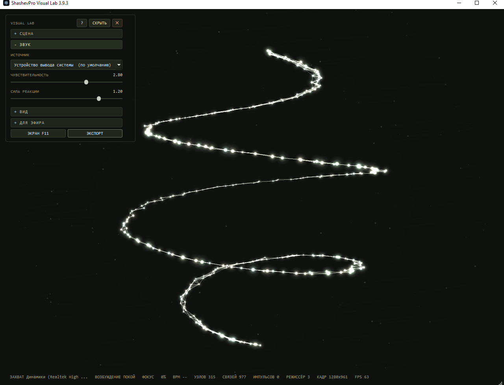
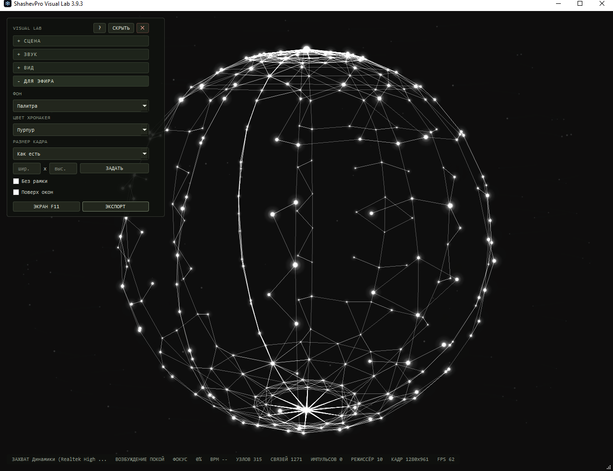
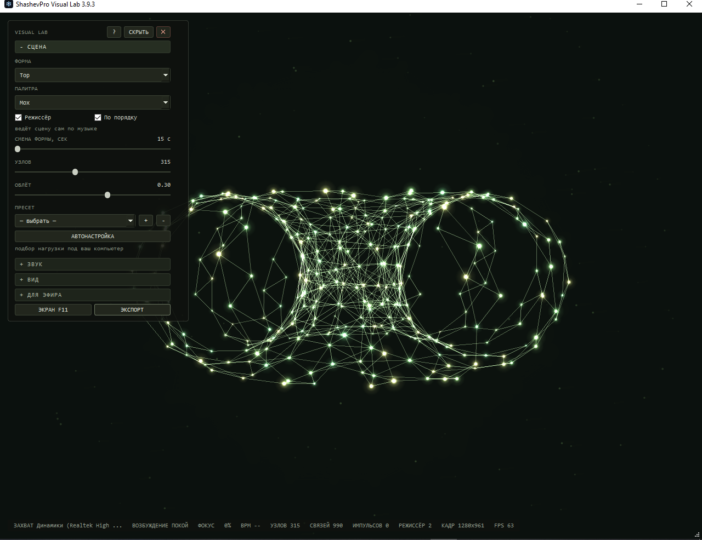
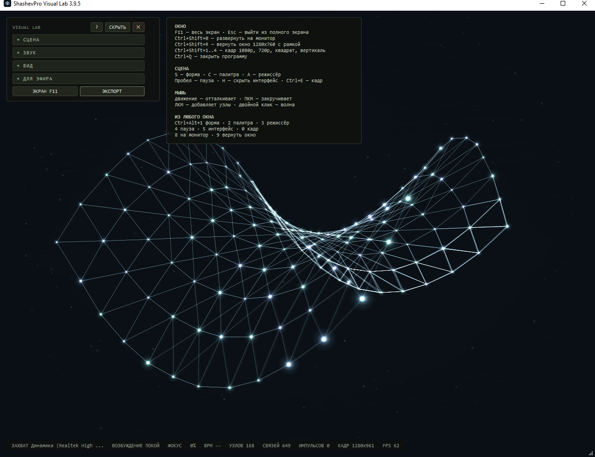
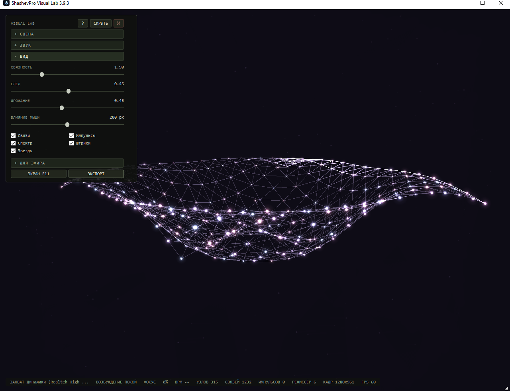

# ShashevPro Visual Lab

**A living field of glowing nodes that listens to your system audio.**

A music visualiser for Windows: 34 volumetric structures, an OBS-ready
broadcast mode and a built-in scene director. Runs fully offline — no
accounts, no subscriptions.

[Русский](README.md) · [Buy](#where-to-buy) · [Changelog](CHANGELOG.md)

---

## What it is

The program listens to whatever is playing through your speakers and turns
it into a field of glowing nodes wired into a three-dimensional mesh. On a
beat the links tighten and the shape snaps into focus; between beats it
softly disperses.

This is not a pre-rendered clip. Every frame is computed from what is
sounding right now, so the picture never repeats.

## Who it is for

- **Streamers and podcasters** — a living backdrop for your broadcast.
  Drops into OBS as a separate source: chroma key or true transparency,
  a borderless window of any size, global hotkeys.
- **Venues** — a screen in a coffee shop, barbershop or showroom running
  to background music.
- **For yourself** — a screensaver on the second monitor.
- **For video** — frame export to PNG, WEBP, JPEG and SVG.

## Features

**34 volumetric structures.** Sphere, torus, helix, galaxy, cube and
icosahedron frames, wave landscape, Möbius strip, knots and braids, double
helix, globe, seashell, bloom, saddle, orbitals, cone, spring, star, weave,
vortex ring, Hilbert curve, Klein bottle and seven strange attractors from
nonlinear dynamics.

**Scene director.** Changes shape and palette at composition boundaries —
a drop into silence, a build-up, a fall, a change of character. Second
mode: sequential, at a steady beat from 15 to 180 seconds.

**Broadcast mode.** Chroma key in three colours, true window transparency,
borderless window of a fixed size, always-on-top, audio source selection,
global hotkeys to switch scenes straight from OBS or from a game.

**Ten palettes** and configurable elements: glowing nodes, links between
nearest neighbours, light pulses travelling along the mesh, a 32-band
spectrum ring, motion streaks and a parallax starfield.

**Mouse as a tool.** Motion repels nodes and locally melts the structure,
the right button swirls, the left adds nodes, a double click sends a
shockwave.

**Scene presets** and **auto-calibration** to your machine's speed.

## Screenshots

| | |
|---|---|
|  |  |
|  |  |

## How it works

Audio is captured through WASAPI loopback — whatever is actually playing
through your speakers. The spectrum is split into bands; spectral flux is
computed separately to detect onsets and estimate tempo. Onset density and
dynamics produce an excitation index that drives the whole scene.

Loudness deliberately carries little weight: calm ambient at full volume
stays calm, dense techno at low volume does not. The character of music
comes from rhythm and dynamics, not from signal level.

Bass drives the breathing of the structure, onsets spike cohesion and emit
pulses along the links, highs add shimmer. There is no radial blast from
the centre: music **reveals** the shape rather than scattering it.

## Requirements

Windows 10 or 11, 64-bit. A sound card with WASAPI support — present on
every modern computer. For streaming: OBS Studio.

Installs into the user profile, no administrator rights required. No
internet needed either to install or to run.

## Honest limitations

- **Per-application capture is not supported.** The program listens to the
  output device as a whole. To isolate music, route the player through a
  virtual cable — a standard setup, instructions included.
- **Window transparency depends on your system.** On some Windows
  configurations it is unavailable at driver and compositor level. Chroma
  key is provided for that case: in OBS the result is identical and it
  always works.
- **This is generative graphics, not drawing from an image.** The program
  does not turn a photograph into particles and does not create an image
  from a text prompt.
- **A frame is exported, not video.** Use OBS to record motion.

## Where to buy

The program is sold on Kwork.

**→ Kwork link**

Three packages: a portable version for personal use, a version with an
installer and the right to use in commercial broadcasts, and a premium
package with a palette matched to your channel colours and remote OBS
setup.

Separately available: branded palette, a custom shape from your sketch, and
a turnkey build for a chain of venues.

## Support

Questions and bug reports: [Issues](../../issues) or
[shashevpro.ru](https://shashevpro.ru).

Please attach the status line from the bottom of the window and the version
from the title bar — that is usually enough to reproduce the problem.

## License

Commercial product. Source code is not distributed.
See [LICENSE](LICENSE).

---

© 2026 ShashevPro · [shashevpro.ru](https://shashevpro.ru)
